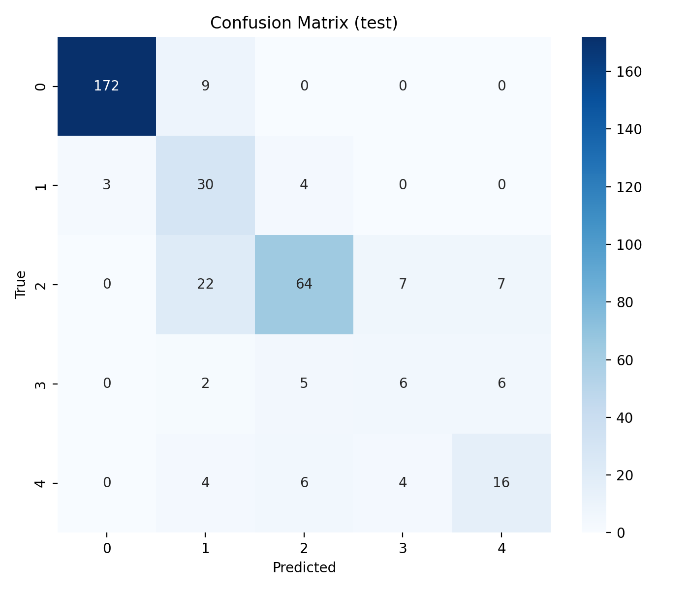

# Explainable AI-Based Diabetic Retinopathy Severity Classification

An AI-assisted diabetic retinopathy screening system that classifies retinal fundus images, generates Grad-CAM explanations, assesses general risk, and produces a downloadable PDF report.

## Live Demo

[Open the deployed Streamlit application](https://diabetic-retinopathy-xai-i9543faumxy5wkjexbwq2i.streamlit.app/)

> **Medical Disclaimer:** This project is intended for educational and screening-support purposes only. It does not provide a medical diagnosis and must not replace examination by a qualified ophthalmologist.

---

## Overview

Diabetic Retinopathy is a diabetes-related eye disease that can lead to vision loss. Early screening and severity assessment can help support timely clinical review.

This project analyzes retinal fundus images and provides:

- Five-class diabetic retinopathy severity classification
- Prediction confidence score
- Image quality checking
- Grad-CAM visual explanation
- Rule-based risk assessment
- General clinical guidance
- Downloadable PDF report
- Streamlit web interface

---

## Diabetic Retinopathy Classes

| Class | Severity |
|---:|---|
| 0 | No Diabetic Retinopathy |
| 1 | Mild Diabetic Retinopathy |
| 2 | Moderate Diabetic Retinopathy |
| 3 | Severe Diabetic Retinopathy |
| 4 | Proliferative Diabetic Retinopathy |

---

## System Workflow

```text
User uploads fundus image
            |
            v
Image quality check
            |
            v
Image preprocessing
            |
            v
Deep learning prediction
            |
            +--> Severity classification
            |
            +--> Confidence score
            |
            +--> Grad-CAM explanation
            |
            +--> Risk assessment
            |
            +--> Clinical guidance
            |
            v
Downloadable PDF report
```

---

## Features

### 1. Image Upload

Users can upload PNG, JPG, or JPEG retinal fundus images through the Streamlit interface.

### 2. Image Quality Assessment

The application checks:

- Blur using variance of the Laplacian
- Image brightness and exposure
- Whether the image is suitable for analysis

Poor-quality images are rejected before prediction.

### 3. Severity Classification

The model predicts one of five diabetic retinopathy severity levels:

- No DR
- Mild DR
- Moderate DR
- Severe DR
- Proliferative DR

### 4. Confidence Score

The application displays the model's confidence for the predicted class.

### 5. Explainable AI

Grad-CAM generates:

- Heatmap visualization
- Overlay visualization
- Highlighted image regions that influenced the prediction

Grad-CAM is used as an interpretability and debugging aid. It should not be treated as a definitive clinical lesion or diagnosis map.

### 6. Risk Assessment

The predicted severity is mapped to a general risk category:

| Severity | General Risk |
|---|---|
| No DR / Mild DR | Low |
| Moderate DR | Medium |
| Severe DR / Proliferative DR | High |

This is a simplified rule-based assessment for demonstration and decision-support purposes.

### 7. Clinical Guidance

The system provides general informational guidance and recommends consultation with an ophthalmologist when appropriate.

The system does not recommend treatments or medications.

### 8. PDF Report

The application generates a downloadable report containing:

- Retinal image
- Predicted severity
- Confidence score
- Risk level
- Grad-CAM overlay
- General guidance
- Disclaimer
- Date and time of analysis

---

## Model and Training

| Component | Choice |
|---|---|
| Deep learning framework | PyTorch |
| Backbone | EfficientNet-B0 |
| Model library | timm |
| Input resolution | 384 × 384 |
| Number of classes | 5 |
| Loss function | Weighted Cross-Entropy Loss |
| Optimizer | AdamW |
| Learning-rate scheduler | Cosine Annealing |
| Explainability | Grad-CAM |
| Web framework | Streamlit |
| PDF generation | ReportLab |

### Why EfficientNet-B0?

EfficientNet-B0 provides a useful balance between:

- Classification performance
- Number of parameters
- Training speed
- GPU memory usage
- CPU inference speed

A 384 × 384 input resolution was selected to provide a practical accuracy–compute trade-off for training on a free Google Colab GPU and running inference in a lightweight application.

---

## Dataset

This project uses the:

**APTOS 2019 Blindness Detection Dataset**

The dataset contains retinal fundus images labeled into five diabetic retinopathy severity categories.

The raw dataset is not included in this repository because it is large. The dataset can be downloaded through Kaggle after accepting the competition rules.

---

## Data Preparation

The dataset was divided using a stratified split:

- 80% training
- 10% validation
- 10% testing

Stratification was used to preserve the class distribution across all splits because diabetic retinopathy datasets are typically imbalanced.

The split files are stored in:

```text
data/splits/
├── train.csv
├── val.csv
└── test.csv
```

Raw images are intentionally excluded from GitHub.

---

## Test Results

The baseline model was evaluated on the held-out APTOS test set.

| Metric | Score |
|---|---:|
| Accuracy | 0.7847 |
| Macro F1 | 0.6268 |
| Quadratic Weighted Kappa | 0.8704 |

### Confusion Matrix



### Metric Interpretation

- **Accuracy** measures the overall proportion of correct predictions.
- **Macro F1** calculates the F1 score independently for each class and averages them, giving equal importance to minority classes.
- **Quadratic Weighted Kappa** is useful for diabetic retinopathy because the classes are ordered. A prediction of Severe instead of Proliferative is penalized less than a prediction of No DR instead of Proliferative DR.

---

## Project Structure

```text
diabetic-retinopathy-xai/
│
├── app/
│   └── main.py
│
├── configs/
│   └── config.yaml
│
├── data/
│   ├── raw/
│   ├── processed/
│   └── splits/
│       ├── train.csv
│       ├── val.csv
│       └── test.csv
│
├── docs/
│   └── results/
│       └── confusion_matrix_test.png
│
├── models/
│   └── best_model.pth
│
├── src/
│   ├── assessment/
│   │   ├── clinical_guidance.py
│   │   └── risk_assessment.py
│   │
│   ├── data/
│   │   ├── augmentation.py
│   │   ├── dataset.py
│   │   └── preprocessing.py
│   │
│   ├── explainability/
│   │   ├── gradcam.py
│   │   └── xai_pipeline.py
│   │
│   ├── models/
│   │   └── model.py
│   │
│   ├── quality/
│   │   └── image_quality.py
│   │
│   ├── report/
│   │   └── pdf_generator.py
│   │
│   ├── training/
│   │   ├── metrics.py
│   │   └── trainer.py
│   │
│   └── utils/
│       ├── logger.py
│       └── seed.py
│
├── evaluate.py
├── train.py
├── requirements.txt
├── runtime.txt
└── README.md
```

---

## Run Locally on Windows

### 1. Clone the repository

```powershell
git clone https://github.com/rithikbatchu22/diabetic-retinopathy-xai.git
cd diabetic-retinopathy-xai
```

### 2. Create a virtual environment

```powershell
python -m venv .venv
```

### 3. Activate the virtual environment

```powershell
.\.venv\Scripts\Activate.ps1
```

If PowerShell blocks activation, run:

```powershell
Set-ExecutionPolicy -Scope CurrentUser -ExecutionPolicy RemoteSigned
```

Then activate again:

```powershell
.\.venv\Scripts\Activate.ps1
```

### 4. Install dependencies

```powershell
python -m pip install --upgrade pip
python -m pip install -r requirements.txt
```

### 5. Confirm the model exists

The trained model should be located at:

```text
models/best_model.pth
```

### 6. Run the Streamlit application

```powershell
python -m streamlit run app/main.py
```

The application will open in your browser.

---

## Run Training on Google Colab

Training was performed on Google Colab using a GPU.

The training command is:

```bash
python train.py --config configs/config.yaml
```

The best checkpoint is saved as:

```text
models/best_model.pth
```

The last training checkpoint is saved as:

```text
models/last_checkpoint.pth
```

The model should be stored safely in Google Drive or another suitable storage location because Colab runtime storage is temporary.

---

## Evaluate the Model

To evaluate the test split:

```bash
python evaluate.py \
  --config configs/config.yaml \
  --weights models/best_model.pth \
  --split test
```

The confusion matrix is saved to:

```text
docs/results/confusion_matrix_test.png
```

---

## Deployment

The application is deployed using Streamlit Community Cloud.

Live application:

https://diabetic-retinopathy-xai-i9543faumxy5wkjexbwq2i.streamlit.app/

The deployment configuration uses:

```text
Application file: app/main.py
Branch: main
```

---

## Limitations

This project has several limitations:

- The model was trained on the APTOS 2019 dataset and may not generalize to all cameras, populations, or clinical environments.
- The dataset contains class imbalance.
- Minority-class performance is lower than majority-class performance.
- Dataset labels may contain noise.
- Image quality strongly affects prediction reliability.
- Grad-CAM highlights influential regions but does not prove clinical causation.
- The risk mapping is simplified and rule-based.
- The system has not been clinically validated.
- The application must not be used as a replacement for professional diagnosis.

---

## Ethical and Safety Statement

This project is an educational and research-oriented prototype.

It is intended to assist healthcare professionals and demonstrate an end-to-end deep learning workflow. It does not provide a medical diagnosis, treatment recommendation, or emergency medical advice.

Users should consult a qualified ophthalmologist for clinical interpretation and decision-making.

---

## Future Improvements

Possible future improvements include:

- Training with larger multi-center datasets
- External validation on an independent dataset
- Model calibration for more reliable confidence scores
- Improved image-quality classification
- Ensemble models
- More advanced lesion detection
- Patient-level progression monitoring
- Support for glaucoma and age-related macular degeneration
- Electronic health record integration
- Authentication and secure medical-data handling
- Multilingual clinical guidance
- Clinical validation with ophthalmologists

---

## Author

**Rithik Batchu**

GitHub repository:

https://github.com/rithikbatchu22/diabetic-retinopathy-xai